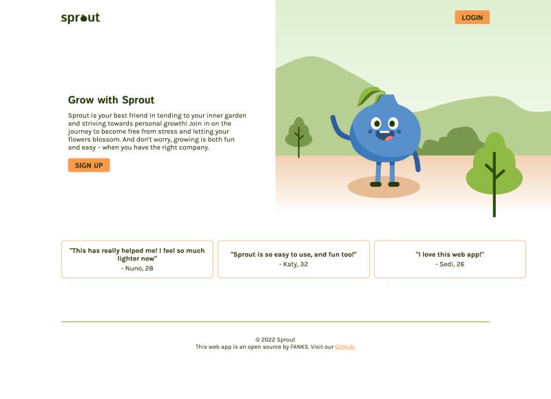

# Fanks-Final-Project, SPROUT:
SPROUT is the final project for the FANKS mob in the Javascript Fullstack Bootcamp at School of Applied Technology. The project is a self-care app made to reduce stress and promote inner growth in your everyday life.

## Live Demo:
[Link to the app](https://growwithsprout.site)

### The group consists of:
[Katy Rosli, ME]
[Filip Nyström]
[Nuno Craveiro]
[Sedigheh Ghazinezam]

## Build with 🛠️:
- React
- JavaScript
- HTML
- CSS
- FIGMA
- AWS (Amazon Web Services)

## Contribution:

Idea & Design:
I pitch 80% of the idea (self care web app). I mock up wireframes and design both UX & UI interface.
I also created a branding workshop with the team. Both logo and all of the illustrations are own by me, as I created them from scratch. 

Code:
Home not logged in - everyone coded as a mob.
Home logged in - everyone coded as a mob.
Breathing activity - coded by Katy (me).
Journal activity - coded by Sedi.
Sleep activity - coded by Filip.
Query activity - coded by Nuno.
CSS - everyonce coded as a mob.

## Available Script:

In the project directory, you can run: npm start

Runs the app in the development mode.
Open http://localhost:3000 to view it in the browser.

The page will reload if you make edits.
You will also see any lint errors in the console. npm test

# Show your support:
Give a ⭐️ if you like this project!

Thank you!

Feel free to contact us for any questions!
/ FANKS mob